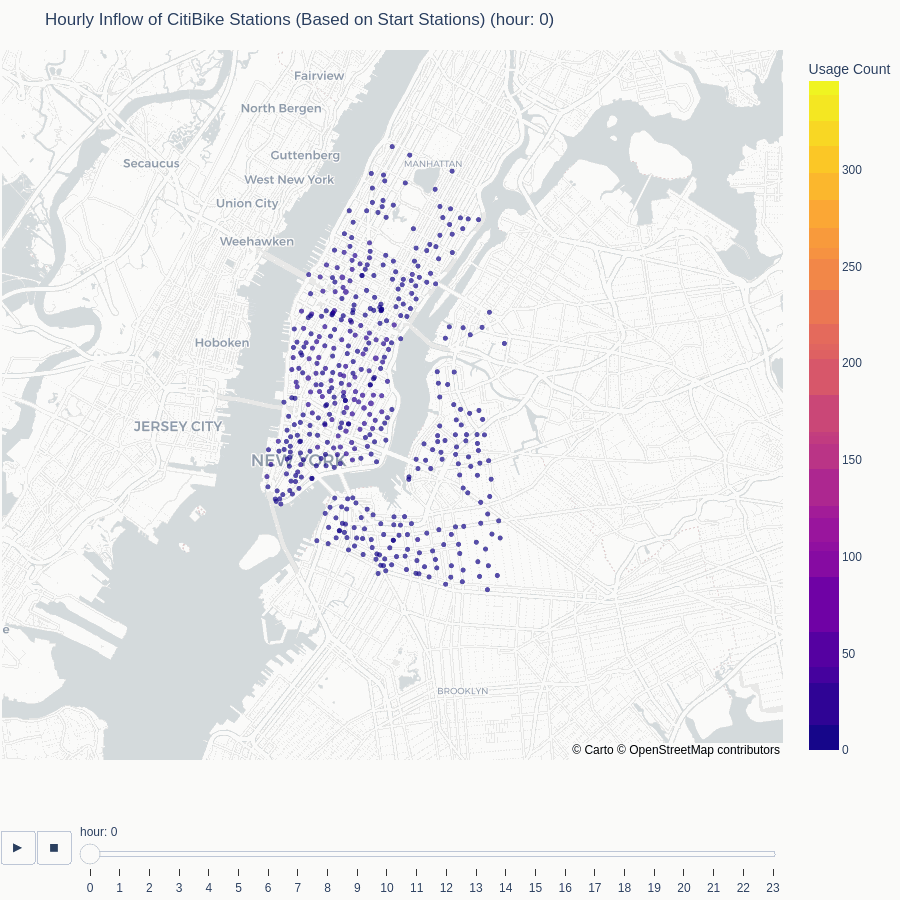

# **Executive Summary**

This report presents a detailed analysis of CitiBike user demographics and the temporal and geospatial patterns of trips. Leveraging these insights, it includes a daily trip forecasting model and a clustering analysis of CitiBike stations based on usage patterns.

---

## **1. User Demographics**

### **1.1 User Age**
- The majority of CitiBike users fall within the **20–60 age range**, indicating that CitiBike primarily serves working professionals and daily commuters.
- A smaller but significant proportion of users older (above 60), suggesting potential opportunities for targeted promotions to these segments.
.png)

### **1.2 Gender Distribution**
- Male users significantly outnumber female users, which deviates from the expected norm. 
- The potential reasons for lower female usage include: **Safety Concerns**, **Convenience** and **Cleanliness and Maintenance** etc.

### **1.3 User Type Distribution**
- **Subscribers** (annual pass users) dominate CitiBike’s user base, benefiting from 24/7 access and reliability for commuting.
- **Business Consideration**:
  - Increasing **customers** (24-hour or 7-day pass users) could boost revenue but may reduce bike availability for subscribers.
  - Maintaining focus on **subscribers** ensures loyalty and consistent usage but limits short-term revenue growth.

  
  
---

## **2. Trips Temporal and Geospatial Patterns**
### **2.1 Trip Duration**
- Most trips last under **1 hour**, reflecting CitiBike's pricing structure and commuter usage patterns:
  - **Subscribers** tend to have shorter, consistent trips, often under 30 minutes.
  - **Customers** have more variability in trip duration, with a higher average and more long-duration trips.
  
  

  

### **2.2 Geolocation Distribution of CitiBike Station Usage Over Time**
- CitiBike stations in **downtown and midtown Manhattan** experience the highest activity, aligning with business districts and major transportation hubs.

- **Morning hours** show significant inflow to stations near office areas, while **evening hours** reflect the opposite flow, with bikes returning to residential areas.

<table>
  <tr>
    <td></td>
    <td></td>
  </tr>
  <tr>
    <td align="center">Hourly Outflow Heatmap</td>
    <td align="center">Hourly Inflow Heatmap</td>
  </tr>
</table>

- Dynamic Visualization links

    - [Hourly Outflow Heatmap of CitiBike Stations](https://zenithsun.github.io/citibike_case_study/html/trip_start_hour_heatmap_animation.html)
    - [Hourly Inflow Heatmap of CitiBike Stations](https://zenithsun.github.io/citibike_case_study/html/trip_stop_hour_heatmap_animation.html)

### **2.3 Number of Trips by Month and Day of Week**
- **Seasonality**: Usage peaks during summer months (June–August) and declines during winter, reflecting weather-related preferences.

- **Weekday vs. Weekend**:
  - **Weekdays**: Higher trip counts driven by subscribers commuting to and from work.
  - **Weekends**: Increased activity from customers engaging in leisure and recreational trips.

  
---

## **3. Citibike Trips Taken per Day Forecast**

### **3.1 Prediction Performance Metrics**
- **Overall User Group** (Subscribers + Customers):
  - Relatively low prediction errors, indicating good model performance.
  - Mean Absolute Percentage Error (MAPE): **12.67%**
  
  
- **Subscribers**:
  - Higher variability compared to the overall group, with a MAPE of **17.06%**.

  
- **Customers**:
  - More challenging to predict due to their inconsistent behavior, reflected by a MAPE of **28.24%**.

  
- **Key Insight**:
  - Aggregated predictions for the total user group perform better due to the smoothing effect of combining subscriber and customer behaviors.
  - Adding external variables (e.g., weather, holidays) could further reduce residual variance and improve prediction accuracy.

---

## **4. CitiBike Station Clustering based on Usage Patterns**

### **4.1 Station Usage Patterns by Cluster**
CitiBike stations were grouped into three clusters based on their typical usage patterns:

1. **Cluster 0 (Office Areas)**:
   - High inflow during **morning commute hours** and high outflow during **evening commute hours**.
   - Stations in this cluster are likely located near office buildings and business districts.
   - Below is the 24-hour netflow of Citibike Stations in Cluster 0
    
2. **Cluster 1 (Residential Areas)**:
   - High outflow in the **morning** and high inflow in the **evening**, reflecting residential areas or transit hubs where users begin or end their commutes.
   - Below is the 24-hour netflow of Citibike Stations in Cluster 1
    

3. **Cluster 2 (Balanced Stations)**:
   - Consistent inflow and outflow throughout the day, with a **net flow close to zero**. These stations may serve areas with a mix of residential, commercial, and recreational facilities.
   - Below is the 24-hour netflow of Citibike Stations in Cluster 2
    

4. Dynamic Visualization link

    - [Clustered CitiBike Stations Map](https://zenithsun.github.io/citibike_case_study/html/clustered_stations_map.html)

For additional details and interactive visualizations, visit the full case study [here](https://zenithsun.github.io/citibike_case_study/Citibike_Case_Study.html).

